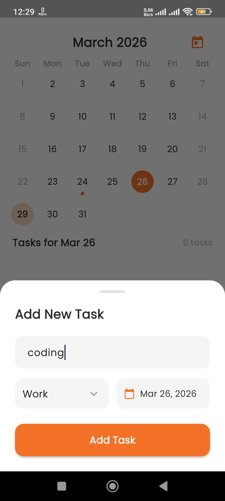
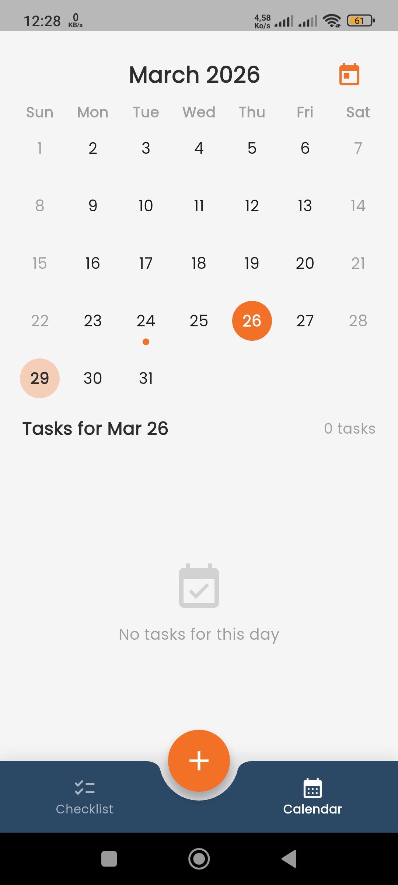
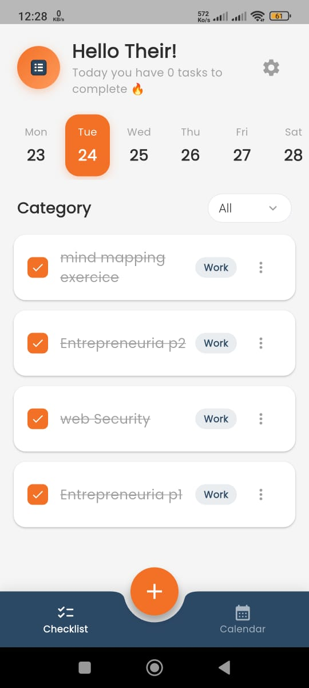

<div align="center">
  <h1>📱 My Todos App</h1>
  <p>A beautiful, responsive, and easy-to-use Todo application built with Flutter.</p>

  <!-- Badges -->
  <a href="https://flutter.dev/"></a>
  <a href="https://dart.dev/"></a>
</div>

## ✨ Features

- **Task Management**: Create, edit, and effortlessly manage your daily tasks.
- **Intuitive UI**: Clean, smooth, and beautiful user interface.
- **Cross-Platform**: Runs seamlessly natively on Android and iOS devices.

## 📸 Screenshots

<div align="center">
  
  &nbsp;&nbsp;
  
  &nbsp;&nbsp;
  
</div>

## 🚀 Getting Started

This project is a starting point for a Flutter application.

### Prerequisites

Ensure you have the following installed on your local machine:
- [Flutter SDK](https://docs.flutter.dev/get-started/install)
- [Dart SDK](https://dart.dev/get-dart)
- An IDE like [Android Studio](https://developer.android.com/studio) or [VS Code](https://code.visualstudio.com/)

### Installation

1. Clone the repository:
   ```bash
   git clone https://github.com/Laktab-Noureddine-code/my-todos.git
   ```

2. Navigate to the project directory:
   ```bash
   cd my-todos
   ```

3. Install dependencies:
   ```bash
   flutter pub get
   ```

4. Run the app:
   ```bash
   flutter run
   ```

## 📚 Learn More

A few resources to get you started if this is your first Flutter project:

- [Lab: Write your first Flutter app](https://docs.flutter.dev/get-started/codelab)
- [Cookbook: Useful Flutter samples](https://docs.flutter.dev/cookbook)

For help getting started with Flutter development, view the [online documentation](https://docs.flutter.dev/), which offers tutorials, samples, guidance on mobile development, and a full API reference.

